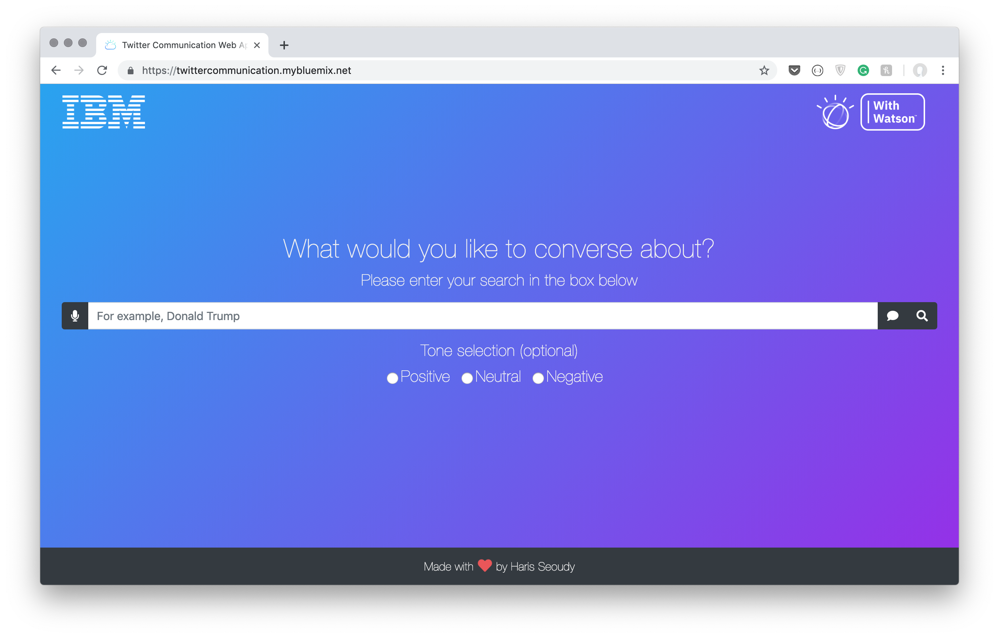

# Twitter Communication Web Application

An Artificial Intelligence powered Web Application that uses Twitter Mining to aid communication for those with difficulties.



## Getting Started

These instructions will get you a copy of the Twitter Communication Web Application up and running on your local machine for development and testing purposes.

### Prerequisites

**Node.js** is JavasScript runtime environment and is required to run the Twitter Communication Web Application locally on your machine. If you haven't already downloaded it and installed it on your machine, you can do so [here](https://nodejs.org/en/).

You need a **IBM Cloud Account** to create text-to-speech & speech-to-text services and generate your API keys. If you haven't already got an account, you can create one [here](https://console.bluemix.net/registration/?target=%2Fdashboard%2Fapps).

Finally, you need a **Twitter Developer Account** account to generate your API keys to access the Twitter API. If you haven't already got an account, you can apply for one [here](https://developer.twitter.com/en/apply-for-access.html).

### Installing

Clone or download this repository to your machine and then using the Terminal/Command Line, change directory to the newly downloaded file by running this command:
 
```bash
cd /TheLocationOfThisRepoistoryOnYourMachine/
```

Once you have navigated to the newly downloaded repository using the Terminal/Command line, install the dependencies by running this command:

```bash
npm install
```
Providing there are no errors with downloading the dependencies, you now have all the files on your machine needed to run the Twitter Communication Web Application.

### API Keys

Login to your **IBM Cloud Account** and instantiate a text-to-speech & speech-to-text service in the location "Dallas". Generate and note down their API keys respectively. Edit the"env.json" file located in the "controller" folder of the repository and copy and paste your text-to-speech & speech-to-text API keys into their respective locations. Save the "env.json" file once this has been done.

Login to your **Twitter Developer Account** and note down your API keys. Edit the"config.js" file and copy and paste your Twitter API keys into their respective locations. Save the "config.js" file once this has been done.

## Usage

To start the server.js file and run the Twitter Communication Web Application in a browser, run this command in the Terminal/Command Line, making sure you are still inside the repository: 

```bash
npm start
```

You should now see this message being displayed in the Terminal/Command Line:

```bash
Twitter Communication Web Application is listening on port: 6003
```

Open a browser and navigate to:
```bash
http://localhost:6003/
```

You will now see the main screen of the Twitter Communication Web Application!

## Built With

* [Node.js](https://nodejs.org/en/) - JavaScript runtime environment
* [Express](https://expressjs.com/) - Node.js web application framework
* [EJS](https://ejs.co/) - Embedded JavaScript templating
* [Watson Developer Cloud](https://www.npmjs.com/package/watson-developer-cloud) - Node.js client library to use the Watson APIs
* [Bootstrap](https://getbootstrap.com/) - Framework for building responsive websites

## Contributing
Pull requests are welcome. For major changes, please open an issue first to discuss what you would like to change.

## Author

[**Haris Seoudy**](https://haris.co)

## Acknowledgments
This project as developed for the authors Final Year Project at [City University of London](https://www.city.ac.uk/) in collaboration with [IBM](https://www.ibm.com/uk-en/).
* Jon McNamara from IBM - came up with the idea for this project
* Ross Paterson from City University of London - the authors Final Year Project supervisor
